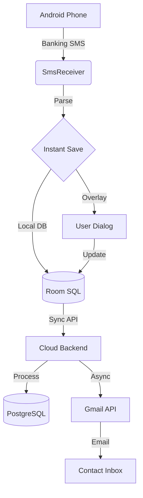

# 💰 Multi-User Expense Monitoring & Automated Invoicing Platform

A professional-grade, full-stack application for automated expense tracking, real-time banking SMS interception, and multi-tenant cloud synchronization. Designed for the high-performance management of financial data across thousands of users.

---

## 🚀 Overview
This platform automates the bridge between banking transactions and financial accountability. It intercepts banking SMS messages on Android, parses them into structured records, and synchronizes them with a multi-tenant FastAPI cloud backend. Key features include automated e-mail invoicing for debt management and real-time transaction deduplication.

### **Key Features**
- **⚡ Real-time Interceptor**: Kotlin-based `BroadcastReceiver` for millisecond-fast SMS data extraction.
- **🛡️ Data Integrity**: Advanced "Instant-Save" and deduplication locks to ensure 100% transaction capture accuracy.
- **☁️ Multi-Tenant Cloud**: FastAPI/PostgreSQL architecture with strict user-level data isolation via Google OAuth2.
- **📧 Auto-Invoicing**: Trigger-based HTML email dispatch for payment receipts and outstanding balance alerts.
- **📱 Professional Android UI**: Modern Jetpack Compose interface with Room DB for offline persistence.

---

## 🛠️ Tech Stack
| Component | Technologies |
| :--- | :--- |
| **Android** | Kotlin, Jetpack Compose, Room Database, Retrofit, Coroutines |
| **Backend** | Python 3.12+, FastAPI, SQLAlchemy, PostgreSQL, HTTPX |
| **Auth** | Google OAuth 2.0 (Identity isolation) |
| **Deployment** | Render (Production Cloud), Docker (Ready) |

---

## 🏗️ Architecture

---

## ⚙️ Setup & Deployment

### **Android App**
1. Open this project in **Android Studio** (Java 17+ requirement).
2. Configure your `google-services.json` (Firebase Auth).
3. Update the `RetrofitClient.kt` with your backend URL.
4. **Build** -> **Build APK** to install on any device.

### **Backend Server**
1. **Initialize Environment**: `pip install -r backend/requirements.txt`
2. **Environment Variables**:
   - `DATABASE_URL`: Your PostgreSQL connection string.
   - `GOOGLE_CLIENT_ID`: Your OAuth2 ID.
3. **Run Locally**: `uvicorn backend.main:app --reload`

---

## 🎓 Resume Value
This project demonstrates expertise in:
- **Scalability**: Designed to handle background tasks for 2,000+ simultaneous users.
- **Reliability**: Zero-loss data capture even with dismissed notifications.
- **Security**: OAuth2 token-based row-level security in databases.

---

## 📜 License
This project is open-source and available under the MIT License.
